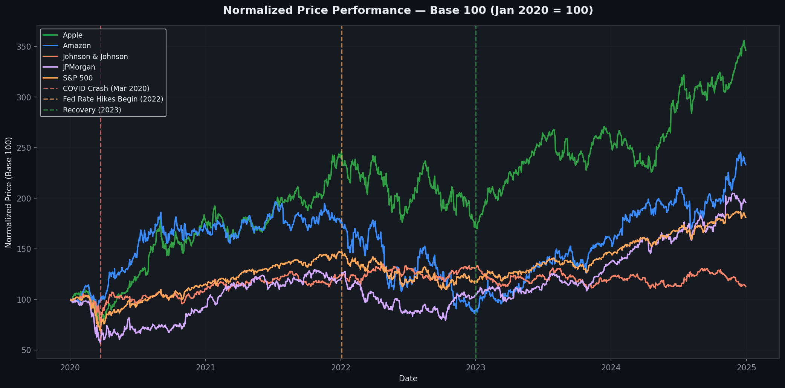
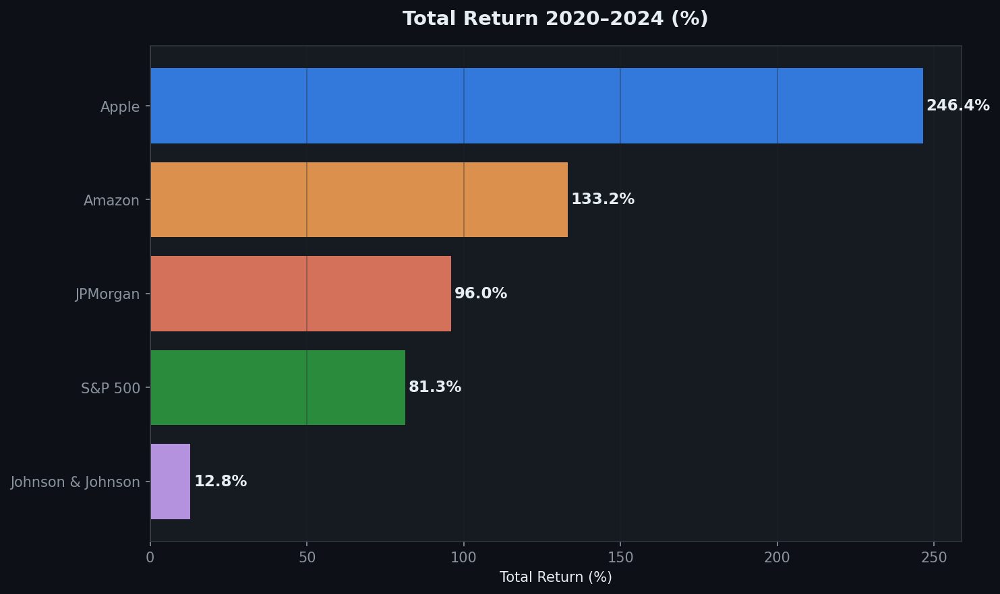
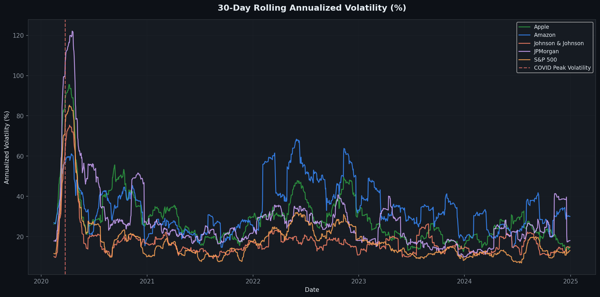
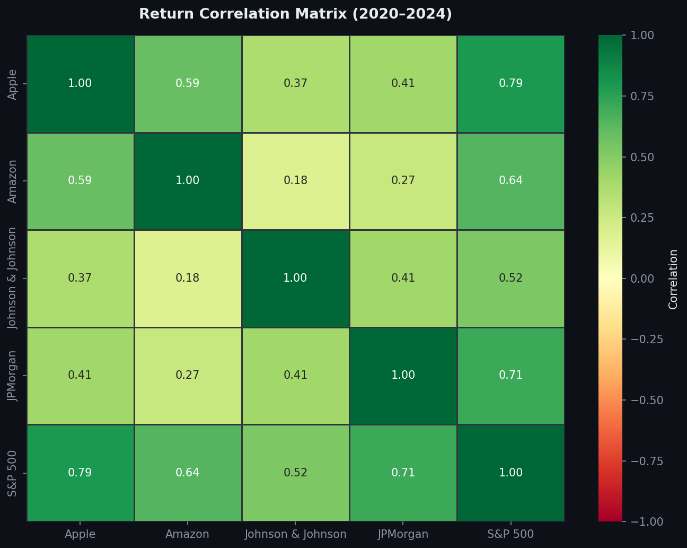
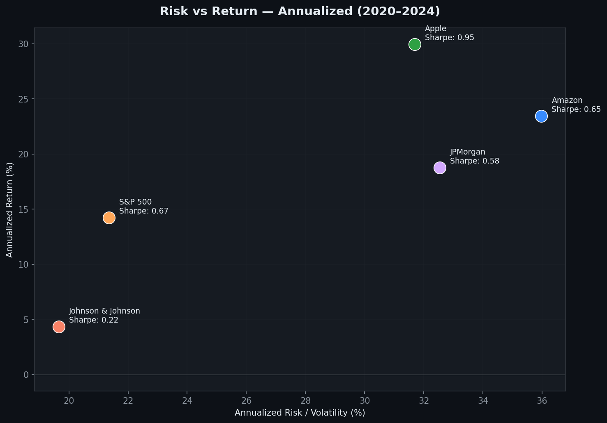
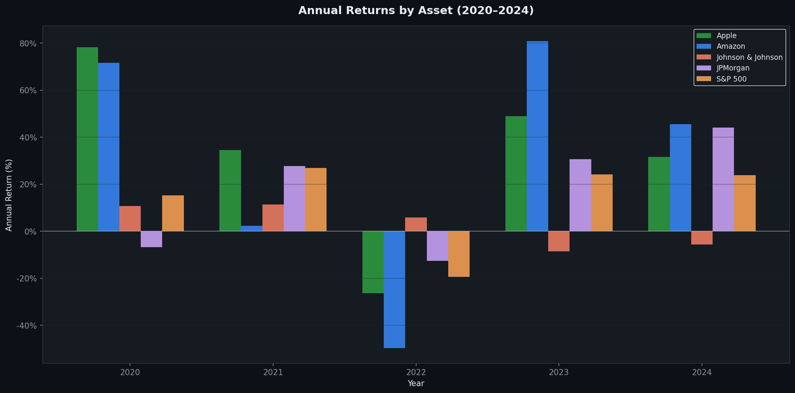

# Stock Market Financial Analysis 📈

## Overview
Comprehensive financial analysis of the S&P 500 and 4 major US stocks 
(Apple, Amazon, JPMorgan, Johnson & Johnson) covering the full market cycle 
from January 2020 to December 2024 — including the COVID crash, Fed rate hike 
cycle and the 2023-2024 bull market recovery.

## Business Questions Answered
1. Which asset delivered the best risk-adjusted return over 5 years?
2. How did each asset behave during the COVID crash and recovery?
3. What is the correlation between assets — diversification opportunities?
4. How does individual stock volatility compare to the broader market?
5. Which years were best and worst for each asset?

## Dataset
- **Source:** Yahoo Finance via yfinance Python library
- **Period:** January 2020 — December 2024
- **Assets:** S&P 500 (^GSPC), Apple (AAPL), Amazon (AMZN), 
  JPMorgan (JPM), Johnson & Johnson (JNJ)
- **Data points:** 1,257 trading days per asset

## Tools Used
- **Python:** yfinance, pandas, matplotlib, seaborn, numpy
- **Analysis:** Returns, volatility, Sharpe ratio, correlation matrix
- **Version Control:** Git & GitHub

## Project Structure
├── stock_analysis.py
├── stock_metrics.csv
└── README.md
---

## Key Metrics (2020–2024)

| Asset | Total Return | Ann. Return | Ann. Volatility | Sharpe Ratio |
|-------|-------------|-------------|-----------------|--------------|
| 🍎 Apple | **+246.4%** | 29.95% | 31.69% | **0.945** |
| 📦 Amazon | +133.2% | 23.46% | 35.98% | 0.652 |
| 🏦 JPMorgan | +96.0% | 18.78% | 32.54% | 0.577 |
| 📊 S&P 500 | +81.3% | 14.23% | 21.35% | 0.667 |
| 💊 J&J | +12.8% | 4.34% | 19.66% | 0.221 |

---

## Visualizations

### 📈 Normalized Price Performance (Base 100)

### 💰 Total Return 2020–2024

### 📊 30-Day Rolling Volatility

### 🔗 Correlation Matrix

### ⚖️ Risk vs Return

### 📅 Annual Returns by Asset

---

## Key Findings

### 🍎 Apple — Best Risk-Adjusted Performance
- **+246% total return** — best performer over the 5-year period
- **Sharpe ratio of 0.945** — highest among all assets analyzed
- Recovered fastest from COVID crash, reaching new highs by August 2020
- Consistent outperformer across 4 of 5 years analyzed

### 📦 Amazon — High Risk, High Reward
- +133% total return but **highest volatility (35.98%)**
- Sharpe of 0.652 — significant risk not fully compensated by returns
- 2022 was catastrophic (-50%) due to post-pandemic correction
- Strong recovery in 2023-2024 driven by AWS and AI tailwinds

### 📊 S&P 500 — Diversification Wins
- **Better Sharpe (0.667) than both JPMorgan and Amazon**
- Confirms the classic argument: broad diversification beats most 
  individual stock selection on a risk-adjusted basis
- Lowest drawdown during 2022 rate hike cycle among growth assets

### 🏦 JPMorgan — Cyclical Financial
- +96% total return, strong performance post-COVID
- Benefits directly from rising interest rates (2022-2023)
- High correlation with S&P 500 (0.80+) — limited diversification benefit

### 💊 Johnson & Johnson — Defensive Asset
- Only **+12.8% over 5 years** — significantly underperformed
- **Lowest volatility (19.66%)** — true defensive characteristics
- Negative or near-zero returns in 2021, 2022, 2023
- Role in portfolio: capital preservation, not growth

### 🔗 Correlation Insights
- All assets show **positive correlation** — no true diversifier in this set
- J&J has lowest correlation with tech assets — best hedge within the group
- High SPY-JPM correlation (0.80+) confirms financials track the market closely

### 📅 Best & Worst Years
- **2020:** Tech (AAPL +82%, AMZN +76%) vs Financials (JPM -7%)
- **2021:** Broad rally — all assets positive
- **2022:** Worst year — rate hikes crushed growth (AMZN -50%, AAPL -26%)
- **2023:** Strong recovery led by tech
- **2024:** Continued bull market — AAPL and AMZN lead

---

## Business Recommendations

1. **For growth investors:** Apple offers the best risk-adjusted return 
   over this cycle — Sharpe of 0.945 is exceptional
2. **For risk-conscious investors:** S&P 500 index outperforms most 
   individual picks on a Sharpe basis — passive beats active here
3. **For defensive positioning:** J&J provides volatility dampening 
   but at significant opportunity cost over a bull market cycle
4. **Portfolio construction:** Adding J&J reduces portfolio volatility 
   due to lower correlation with tech assets
5. **Rate sensitivity:** JPMorgan is the clearest beneficiary of 
   rising rate environments — useful tactical allocation signal

---

## Author
**Simón Segovia** | Financial & Data Analyst  
📧 simon.segoviavalen@gmail.com  
💼 [LinkedIn](https://www.linkedin.com/in/simón-sebastián-segovia-valenzuela-6505b1259)  
🐙 [GitHub](https://github.com/segobooking-finanz)
